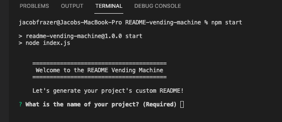

    
# README Vending Machine

## License

## Description
    
Node CLI application that generates professional README(s)

## Screenshot

        

## Table of Contents

* [Installation](#installation)
* [Usage](#usage)
* [Credits](#credits)
* [License](#license)
* [Tests](#tests)
* [Questions](#questions)
    
## Installation

install Node, then npm package manager, then run npm install

## Usage

run npm start from the app directory, then follow the CLI prompts, get README!

## Credits

*[@coderjake2](https://github.com/coderjake2)

## Contributing

## Tests
no current test method

## Questions

Please send additional questions to [@coderjake91](https://github.com/coderjake91), email: coderjake@email.com